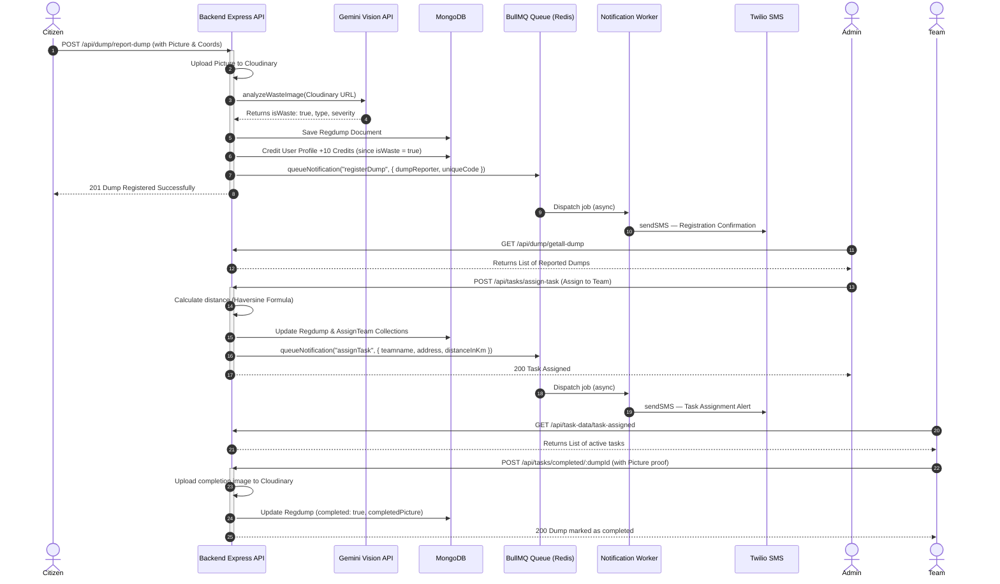

# Eco-Pulse: Backend System & API Documentation

## 1. Executive Summary & Value Proposition

### What is Eco-Pulse?
**Eco-Pulse** is a smart, AI-enriched municipal waste management and environmental monitoring platform. It bridges the gap between civic responsibility, municipal administration, and ground-level sanitation services. By dividing the system into three primary actors - **Citizens (Users)**, **Municipal Admins (Municipality Officers)**, and **Cleaning Teams** - Eco-Pulse creates a synchronized, closed-loop workflow that ensures public waste heaps are reported, verified, assigned, and cleaned efficiently.

---

### The Real-World Problem
Traditional waste management systems in most urban areas are **highly reactive, non-transparent, and operationally inefficient**. The typical process suffers from several critical bottlenecks:
* **Citizen Disconnection:** Citizens have no direct, transparent, or immediate way to report open garbage dumps, overflowing bins, or environmental hazards in their neighborhoods.
* **Administrative Blindspots:** Municipalities lack real-time visibility into the geographical distribution of waste piles, leading to inefficient scheduling, fuel wastage, and slow responses.
* **Operational Inefficiencies:** Cleaning teams are often deployed randomly or on fixed routes rather than directed to areas of high severity, resulting in neglected trouble zones.
* **No Incentive Structure:** Citizens lack any motivation or rewards for reporting issues, keeping them disengaged.

---

### Why is this Problem So Big?
* **Unprecedented Urbanization:** As cities expand rapidly, the volume of municipal solid waste scales exponentially, quickly outstripping traditional public utility capacities.
* **Public Health Crises:** Unmanaged open waste heaps act as breeding grounds for vectors (mosquitoes, rodents) and pathogens, leading to outbreaks of deadly infectious diseases such as dengue, malaria, cholera, and typhoid.
* **Environmental Degradation:** Rainwater runoff carrying toxic chemicals from illegal dumps pollutes groundwater tables, contaminates soil, and compromises local ecosystems.
* **High Economic and Labor Waste:** Municipalities waste millions on fuel, vehicle wear-and-tear, and labor because sanitation dispatch is not optimized for location and severity.

---

### The Ideology Behind the Solution
The ideology of Eco-Pulse is rooted in **civic gamification, automated artificial intelligence verification, and geospatial optimization**:
* **Empowering the Citizen:** Citizens are not passive observers but active nodes in a decentralized monitoring network. By reporting dumps, they act as the "eyes" of the city.
* **Intelligent Automation (AI):** Using advanced computer vision (Gemini model), the platform automatically filters reports, validates whether a photo depicts actual waste, classifies its type, and rates its severity. This eliminates spam and prioritizes severe issues without human intervention.
* **Gamification & Eco-Credits:** Rewarding citizens with "Eco-Credits" upon successful AI verification of their reports turns waste monitoring into a game, encouraging sustained civic hygiene participation.
* **Geospatial Efficiency:** Tasks are assigned based on the Haversine distance from the cleaning team's location. This ensures the nearest team is dispatched, saving response time, lowering carbon emissions, and optimizing municipal operational budgets.

---

### How Eco-Pulse Stands Out in the Market
1. **Gemini Vision Integration:** Unlike standard ticket-raising platforms, Eco-Pulse uses AI to verify images of waste in real time, preventing spoofing and automating classification.
2. **Citizen-to-Clean Loop:** A single platform handles citizen reporting, automated verification, admin routing, real-time SMS dispatches (via Twilio), and photographic verification of completion.
3. **Eco-Credits Economy:** Introducing a credit-incentive system directly drives high engagement among younger, mobile-first demographics.
4. **Proximity-Based Routing:** Admin panels visually map reports and assign teams dynamically by calculating exact distances, replacing outdated routing sheets.

---

## 2. Core Features of Eco-Pulse

* **AI-Assisted Dump Reporting:** Users take a picture of a dump. The backend uploads it to Cloudinary, processes it via Gemini API to identify waste details, and saves coordinates.
* **Eco-Credits System:** Verified waste submissions award 10 Eco-Credits to the citizen’s profile, fostering a gamified environment.
* **Citizen Complaint Center:** Users can lodge complaints about broken smart bins (`bin-issue`) or report municipal inaction on unresolved dumps (`dump-inaction`).
* **Interactive Geo-Spatial Map:** Generates location markers for all tasks showing status, time reported, and team assignment.
* **Geographic Proximity Auto-Routing:** The admin assigns dumps to cleaning teams. The backend calculates distance in kilometers using the Haversine formula.
* **Asynchronous SMS Notification Queue (BullMQ + Redis):**
  * All Twilio SMS dispatches are processed through a Redis-backed BullMQ queue rather than being called inline during a request. This makes API responses instant and ensures SMS delivery is retried automatically (up to 3×) on failure.
  * Citizens receive an SMS upon registering a dump with a unique tracking code.
  * Cleaning teams receive SMS alerts containing task codes, addresses, and calculated distances when assigned.
  * OTP delivery for user verification is also routed through the queue.
* **Closed-Loop Cleanliness Verification:** Teams mark tasks as completed by uploading a "proof of cleaning" image.
* **Recyclable Item Pickups:** Citizens list large recyclable items (plastic bundles, e-waste, organic waste), which municipalities or recycling centers can collect.
* **PrakritiAI Assistant:** A Gemini-powered, context-aware chatbot trained on sustainability, offering eco-tips and platform guidelines.

---

## 3. Technology Stack & Backend Architecture

The backend of Eco-Pulse is designed as a modular, scalable Node.js/Express application utilizing the ES module system:

* **Runtime & Framework:** Node.js, Express (with `express-rate-limit` for DDoS prevention).
* **Database & ORM:** MongoDB & Mongoose. Indexes are optimized for geospatial queries (GeoJSON `Point` and `2dsphere` indexes).
* **AI Engine:** `@google/genai` and `@google/generative-ai` invoking `gemini-2.5-flash-preview-09-2025` for waste analysis and the PrakritiAI conversational chatbot.
* **Cloud Storage & Image Processing:** Cloudinary (secure image uploads) and Multer (handling multipart form-data in-memory) coupled with Sharp (resizing, compressing, and formatting images).
* **SMS Notifications:** Twilio SDK dispatches SMS alerts. All Twilio calls are decoupled from request handlers and routed through a **BullMQ** job queue backed by **Redis (ioredis)**, ensuring non-blocking, retry-capable delivery.
* **Job Queue & Worker:** `bullmq` (queue management) + `ioredis` (Redis client). A single `notification.worker.js` process runs alongside the Express server and consumes jobs from the `notificationQueue`.
* **Real-time Communication:** Socket.io (live event broadcasting).
* **Scheduling:** `node-cron` for periodic backend keep-alive pings during active hours (skipping the sleep window of 1 AM - 7 AM IST).

---

## 4. Data Models Schema (Mongoose)

### 1. User (`models/user.model.js`)
Stores details of citizen users who report waste, earn credits, and lodge complaints.
* `fullname`: String (Required)
* `email`: String (Required, Unique, Email format validation)
* `phone`: Number (Required, Unique, Indian 10-digit validation)
* `password`: String (Required, Hashed with bcrypt)
* `avatar`: String (Cloudinary URL)
* `dumpRegistered`: Array of ObjectIds (References `Regdump`)
* `state`: String
* `district`: String
* `credits`: Number (Default: `0`)
* `refreshToken`: String

### 2. Admin (`models/admin.model.js`)
Stores profiles of municipal officers responsible for a specific district.
* `fullname`: String (Required)
* `email`: String (Required, Unique, Email format validation)
* `pincode`: Number (Required)
* `district`: String (Required, Unique)
* `state`: String (Required)
* `adminOfficer`: String (Required)
* `helpLineNumber`: Number
* `password`: String (Required, Hashed with bcrypt)
* `location`: GeoJSON Point (`type`: "Point", `coordinates`: `[lng, lat]`)
* `complaintReceived`: Array of ObjectIds (References `RegisterComplain`)
* `refreshToken`: String

### 3. AssignTeam (`models/assignTeam.model.js`)
Profiles for local sanitation/cleaning teams registered by the admin.
* `teamname`: String (Required, Unique)
* `email`: String (Required, Unique)
* `phone`: Number (Required, Unique, 10-digit validation)
* `password`: String (Required, Hashed with bcrypt)
* `address`: String (Required)
* `location`: GeoJSON Point (Required, `type`: "Point", `coordinates`: `[lng, lat]`)
* `state`: String
* `district`: String
* `avatar`: String
* `assignedWork`: Array of ObjectIds (References `Regdump`)
* `refreshToken`: String
* *Index*: Geospatial `2dsphere` on location.

### 4. Regdump (`models/registerDump.model.js`)
Represents reported dumps which act as cleaning tasks.
* `address`: String (Required)
* `location`: GeoJSON Point (`type`: "Point", `coordinates`: `[lng, lat]`)
* `district`: String
* `state`: String
* `picture`: String (Required, Cloudinary image URL of the reported waste)
* `description`: String
* `dumpReporter`: ObjectId (References `User`)
* `teamAssigned`: Boolean (Default: `false`)
* `assignedTeam`: ObjectId (References `AssignTeam`)
* `completed`: Boolean (Default: `false`)
* `complainLodge`: Boolean (Default: `false`)
* `completedPicture`: String (Cloudinary image URL of the cleaned area)
* `uniqueNumber`: Number (Required, 3-digit random code used in SMS and complaints)
* `aiAnalysis`: Object (Stores structured JSON response from Gemini)
* `timestamps`: Enabled (`createdAt`, `updatedAt`)

### 5. GeneralComplaint (`models/generalComplaint.model.js`)
Stores complaints raised by users regarding garbage dumps or bins.
* `complaintType`: String (Enum: `["bin-issue", "dump-inaction"]`, Required)
* `description`: String (Required)
* `relatedDump`: ObjectId (References `Regdump`, Required if type is `dump-inaction`)
* `binUniqueCode`: String (Required if type is `bin-issue`)
* `location`: GeoJSON Point (`type`: "Point", `coordinates`: `[lng, lat]`)
* `address`: String
* `district`: String
* `state`: String
* `pincode`: String (Required)
* `user`: ObjectId (References `User`, Required)
* `assignedTeam`: ObjectId (References `AssignTeam`)
* `resolved`: Boolean (Default: `false`)
* `imageUrl`: String (Cloudinary URL)
* `aiAnalysis`: Object (Gemini Vision JSON details)
* `timestamps`: Enabled

### 6. Recycle (`models/recycle.model.js`)
Tracks consumer requests for recyclable waste pickup.
* `user`: ObjectId (References `User`)
* `recycableItems`: String (Required)
* `description`: String
* `image`: String (Cloudinary URL)
* `quantity`: Number (Required)
* `status`: String (Enum: `["Pending", "Collected", "Rejected"]`, Default: `Pending`)
* `address`: String (Required)
* `district`: String
* `state`: String
* `location`: GeoJSON Point (`type`: "Point", `coordinates`: `[lng, lat]`)
* `timestamps`: Enabled

### 7. SmartBin (`models/SmartBin.model.js`)
Tracks IoT-simulated smart public garbage bins.
* `uniqueCode`: String (Required)
* `pincode`: Number (Required)
* `location`: GeoJSON Point (`type`: "Point", `coordinates`: `[lng, lat]`)
* `district`: String
* `state`: String
* `fillLevel`: Number (Required, Percentage filled)
* `status`: String (Enum: `["green", "orange", "red"]`, Required)
* `assignedTeam`: ObjectId (References `AssignTeam`)
* `lastUpdated`: Date (Default: `Date.now`)

### 8. Notification (`models/notification.model.js`)
System notifications broadcasted to users, admins, or cleaning teams.
* `title`: String (Required)
* `message`: String (Required)
* `type`: String (Enum: `["ALERT", "INFO", "WARNING"]`, Default: `INFO`)
* `recipient`: ObjectId (Polymorphic, referenced by `recipientModel`)
* `recipientModel`: String (Enum: `["User", "Admin", "AssignTeam"]`)
* `read`: Boolean (Default: `false`)
* `priority`: String (Enum: `["LOW", "MEDIUM", "HIGH"]`, Default: `LOW`)

---

## 5. Controller Work & Business Logic

### `user.controller.js`
* **`registerUser`:** Registers a citizen. Validates mandatory fields and email/phone uniqueness. It creates the account with a hashed password, generates JWT access and refresh tokens, sets them in secure cookies, and returns the profile.
* **`loginUser`:** Authenticates a citizen by email or phone. Validates password hashes, generates new tokens, updates cookies, and returns user details.
* **`getCurrentUser`:** Returns the details of the citizen currently logged in.

### `admin.controller.js`
* **`registerAdmin`:** Registers a municipality administrator. It ensures that only one admin can represent a single district. Upon creation, sets JWT access/refresh tokens in HTTP-only cookies.
* **`loginAdmin`:** Authenticates the district admin using email or district name and password.
* **`getCurrentAdmin`:** Retrieves logged-in admin data from middleware context.

### `assignTeam.controller.js`
* **`registerTeam` (Admin Secured):** Admin-only route allowing a municipality officer to register a cleaning team under their district. Generates credentials and logs the team in.
* **`loginTeam`:** Allows cleaning team members to log in with their email/team name.
* **`getAllTeam`:** Fetches a list of all registered teams.
* **`assignTask` (Admin Secured):** Assigns a reported dump to a team. The business logic performs a proximity calculation using the **Haversine formula** to measure the distance in kilometers between the team's home coordinate and the dump location. It establishes Mongoose references, then **enqueues an `assignTask` BullMQ job** (instead of calling Twilio directly) so the team SMS notification is handled asynchronously.
* **`workCompleted` (Team Secured):** Allows cleaning teams to mark an assigned task as clean. The team uploads an image of the clean location, which is uploaded to Cloudinary. The dump document's status updates `completed` to `true` and records `completedPicture`.

### `assignedTask.controller.js`
* **`assignedTasks` (Team Secured):** Queries the authenticated team's profile and returns a filtered list of their active assigned work (`completed === false`), alongside their team details.

### `Complain.controller.js`
* **`complaintRegistered` (User Secured):** Registers citizen complaints. If complaint is a `bin-issue`, `binUniqueCode` must be provided. If the user uploads an image, the backend uploads it to Cloudinary and runs Gemini AI verification (`analyzeWasteImage`). If the AI validates that waste is present, 10 Eco-Credits are credited to the user's profile.
* **`viewComplains`:** Fetches all complaints sorted by creation date.

### `registerDump.controller.js`
* **`registerDump` (User Secured):** Citizens report a waste dump. It takes a comma-separated coordinate string, transforms it into a GeoJSON Point format, uploads the photo to Cloudinary, generates a random 3-digit tracking code, and runs Gemini AI analysis. If AI identifies waste, 10 credits are added to the user's account. Finally, it **enqueues a `registerDump` BullMQ job** — the SMS confirmation is sent asynchronously by the worker, so the API responds immediately.
* **`getAllDump`:** Fetches all registered dumps, populating details of the reporter and the cleaning team.

### `recycle.controller.js`
* **`createRecycle` (User Secured):** Handles recyclable material pick-up requests. Saves item description, quantity, coordinates, address, and an optional image to Cloudinary.
* **`getAllRecycle`:** Retrieves all recycling requests populated with the submitting user's details.

### `stats.controller.js`
* **`dumpStats`:** Generates stats for the dashboard. It runs parallel database operations (`Promise.all`) to count total tasks, completed tasks, smart bins, and recycled items. It calculates dump completion rates and recycling success rates, and executes a MongoDB aggregation pipeline to find the top 5 citizens with the most registered dumps.

### `chatbot.controller.js`
* **`responseMessage`:** Manages interactions with PrakritiAI. It routes messages to Gemini API using a system prompt that mandates eco-friendly, helpful, concise guidelines (under 90 words). It utilizes **Exponential Backoff Retry** (up to 4 attempts with increasing delays) to prevent API rate-limiting issues, falling back to pre-defined tips if Gemini fails.

---

## 6. API Route & Endpoint Directory

All routes are mounted on `/api` under `server.js`.

### 1. Authentication Routes (`/api/auth`)
Mounted on `routes/auth.route.js`.

| Method | Endpoint | Middleware | Description |
| :--- | :--- | :--- | :--- |
| `POST` | `/auth/admin/signup` | *None* | Registers a new municipality Admin. |
| `POST` | `/auth/admin/login` | *None* | Logs in a municipality Admin. |
| `GET` | `/auth/admin/profile` | `verifyAdmin` | Gets logged-in admin details. |
| `POST` | `/auth/user/signup` | *None* | Registers a new citizen user. |
| `POST` | `/auth/user/login` | *None* | Logs in a citizen user. |
| `GET` | `/auth/user/profile` | `verifyUser` | Gets logged-in user details. |
| `POST` | `/auth/team/signup` | `verifyAdmin` | Allows an admin to register a cleaning team. |
| `POST` | `/auth/team/login` | *None* | Logs in a cleaning team member. |
| `GET` | `/auth/verify-token` | `verifyAnyToken` | Validates a token and returns the role/profile. |
| `GET` | `/auth/logout` | `verifyAnyToken` | Logs out the actor and unsets auth cookies. |

### 2. Team Routes (`/api/teams`)
Mounted on `routes/teams.js`.

| Method | Endpoint | Middleware | Description |
| :--- | :--- | :--- | :--- |
| `GET` | `/teams/` | `verifyAdmin` | Fetches all registered teams in the database. |
| `POST` | `/teams/` | `verifyAdmin` | Simple endpoint to create a team directly. |

### 3. Task Management Routes (`/api/tasks`)
Mounted on `routes/tasks.route.js`.

| Method | Endpoint | Middleware | Description |
| :--- | :--- | :--- | :--- |
| `POST` | `/tasks/assign-task` | `verifyAdmin` | Assigns a dump report to a cleaning team. |
| `POST` | `/tasks/completed/:dumpId` | `verifyTeam`, `upload` | Marks task completed and uploads a proof photo. |
| `GET` | `/tasks/get-all-assignteam` | *None* | Fetches a list of all cleaning teams. |

### 4. Dump Reporting Routes (`/api/dump`)
Mounted on `routes/dumps.routes.js`.

| Method | Endpoint | Middleware | Description |
| :--- | :--- | :--- | :--- |
| `POST` | `/dump/report-dump` | `uploadMiddleware`, `verifyUser` | Citizens report a dump (uploads picture to Cloudinary + AI analysis). |
| `GET` | `/dump/getall-dump` | *None* | Fetches all registered dumps. |

### 5. Complaint Routes (`/api/complain`)
Mounted on `routes/complain.routes.js`.

| Method | Endpoint | Middleware | Description |
| :--- | :--- | :--- | :--- |
| `POST` | `/complain/loadge-complain` | `verifyUser`, `uploadMiddleware` | Registers a citizen complaint (awards credits if waste image is AI verified). |
| `GET` | `/complain/view-complain` | *None* | Fetches all complaints sorted by creation time. |

### 6. Recycling Routes (`/api/recycle`)
Mounted on `routes/recycle.routes.js`.

| Method | Endpoint | Middleware | Description |
| :--- | :--- | :--- | :--- |
| `POST` | `/recycle/create-recycle` | `verifyUser`, `upload.single("image")` | Lodges a recyclable item pickup request. |
| `GET` | `/recycle/get-all-recycle` | *None* | Fetches all recycling pickup requests. |

### 7. Dashboard Stats Route (`/api/stats`)
Mounted on `routes/stats.route.js`.

| Method | Endpoint | Middleware | Description |
| :--- | :--- | :--- | :--- |
| `GET` | `/stats/get-details` | *None* | Computes system metrics, counts, and top users list. |

### 8. Team Task Queries (`/api/task-data`)
Mounted on `routes/assignedTask.route.js`.

| Method | Endpoint | Middleware | Description |
| :--- | :--- | :--- | :--- |
| `GET` | `/task-data/task-assigned` | `verifyTeam` | Returns all pending assigned work for the logged-in team. |

### 9. Chatbot Route (`/api/chat`)
Mounted on `routes/chatbot.route.js`.

| Method | Endpoint | Middleware | Description |
| :--- | :--- | :--- | :--- |
| `POST` | `/chat/get-response` | *None* | Relays questions to PrakritiAI and handles retries. |

### 10. Map Route (`/api/map`)
Mounted on `routes/map.js`.

| Method | Endpoint | Middleware | Description |
| :--- | :--- | :--- | :--- |
| `GET` | `/map/locations` | `verifyUser` | Fetches active task coordinates to populate map markers. |

### 11. Legacy Reports Routes (`/api/report-dump` & `/api/dump-reports`)
Mounted on `routes/reports.js`.

| Method | Endpoint | Middleware | Description |
| :--- | :--- | :--- | :--- |
| `POST` | `/report-dump/` | *None* | Simple dump reporter without token validation. |
| `GET` | `/report-dump/` | `verifyAdmin` | Fetches all legacy dump reports. |

### 12. Upload Test Route (`/api/upload`)
Mounted on `routes/upload.js`.

| Method | Endpoint | Middleware | Description |
| :--- | :--- | :--- | :--- |
| `POST` | `/upload/` | `uploadMiddleware`, `processImage` | Uploads an image, resizes/compresses it via Sharp, and stores it in `uploads/`. |

---

## 7. Operational Workflow Flowcharts

### Dump Report & Clean-up Cycle


---

## 8. SMS Notification Queue Architecture

All SMS notifications are processed **asynchronously** through a BullMQ job queue backed by Redis. This decouples Twilio API latency from the HTTP request lifecycle.

### Key Files

| File | Role |
| :--- | :--- |
| `config/redis.js` | Creates a shared `ioredis` connection (`maxRetriesPerRequest: null` required by BullMQ). |
| `queues/notification.queue.js` | Instantiates the `notificationQueue` BullMQ Queue and exports `queueNotification(jobName, data)` producer helper. |
| `workers/notification.worker.js` | BullMQ Worker — consumes jobs and calls `sendSMS()` via `utils/twilio.js`. Bootstrapped by `server.js` at startup. |
| `utils/twilio.js` | Thin Twilio client wrapper. Only ever called by the worker, never by controllers directly. |

### Job Types

| Job Name | Payload Fields | Triggered By |
| :--- | :--- | :--- |
| `registerDump` | `dumpReporter`, `uniqueCode` | `registerDump.controller.js` after dump is saved |
| `assignTask` | `teamname`, `uniqueNumber`, `address`, `distanceInKm` | `assignTeam.controller.js` after task assignment |
| `sendOTP` | `otp` | `user.controller.js` (currently commented — awaiting OTP flow) |

### Queue Configuration

```js
defaultJobOptions: {
  attempts: 3,               // Auto-retry 3 times on Twilio failure
  backoff: { type: "exponential", delay: 5000 }, // 5s → 10s → 20s
  removeOnComplete: true,    // Successful jobs cleaned up from Redis
  removeOnFail: false,       // Failed jobs retained for debugging
}
```

### Worker Configuration

```js
concurrency: 5  // Up to 5 SMS jobs processed in parallel
```

### Data Flow

```
HTTP Request
    │
    ▼
Controller  ──►  queueNotification("jobName", data)  ──►  Redis Queue
    │                                                           │
    ▼                                                           ▼ (async)
API responds instantly                              notification.worker.js
                                                           │
                                                           ▼
                                                   sendSMS() via Twilio SDK
```

---

## 9. Development & Local Execution

1. **Environment Configuration:**
   Copy `.env.example` to `.env` and fill in the required keys:
   ```env
   PORT=3001
   MONGODB_URI=mongodb://localhost:27017
   ACCESS_TOKEN_SECRET=your_jwt_access_secret
   ACCESS_TOKEN_EXPIRY=1d
   REFRESH_TOKEN_SECRET=your_jwt_refresh_secret
   REFRESH_TOKEN_EXPIRY=10d
   CORS_ORIGIN=http://localhost:5173
   GEMINI_API_KEY_VISION=your_google_gemini_api_key
   CLOUDINARY_CLOUD_NAME=your_cloudinary_name
   CLOUDINARY_API_KEY=your_cloudinary_key
   CLOUDINARY_API_SECRET=your_cloudinary_secret
   ACCOUNT_SID=your_twilio_account_sid
   AUTH_TOKEN=your_twilio_auth_token
   MESS_FROM=your_twilio_phone_number
   REDIS_HOST=127.0.0.1
   REDIS_PORT=6379
   REDIS_PASSWORD=            # Leave blank for local Redis without auth
   BACKEND_URL=http://localhost:3001
   ```

2. **Prerequisites:**
   - A running **Redis** instance is required for the BullMQ notification queue.
   - Local: `redis-server` (or via Docker: `docker run -p 6379:6379 redis`)
   - The notification worker starts automatically when the server boots — no separate process needed.

3. **Installation & Startup:**
   ```bash
   cd backend
   npm install
   npm run dev
   ```
